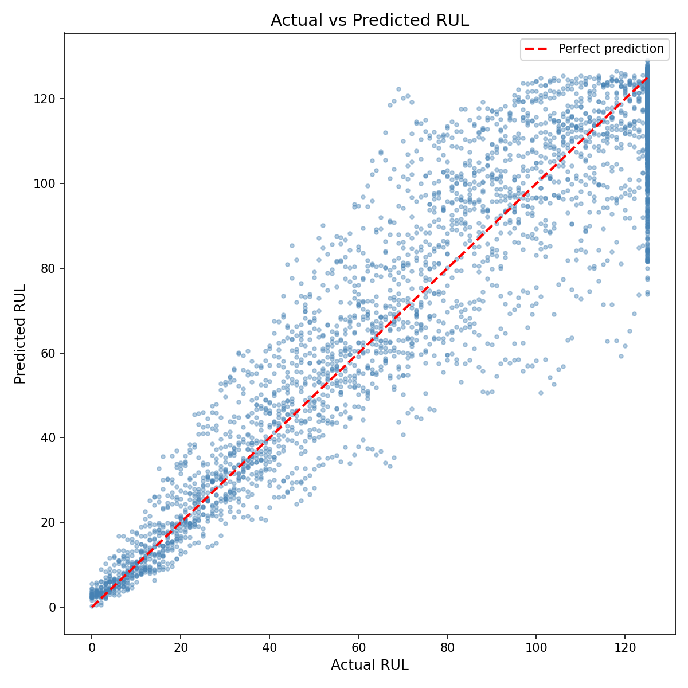
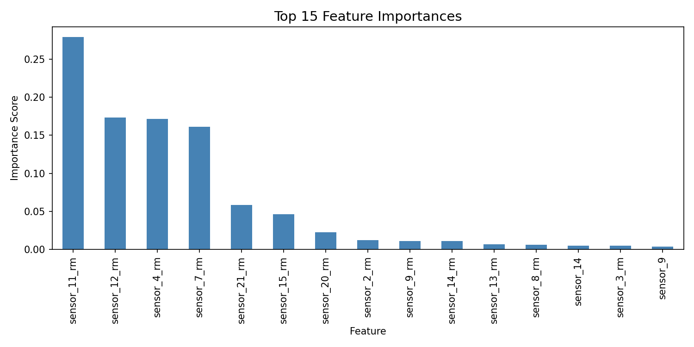
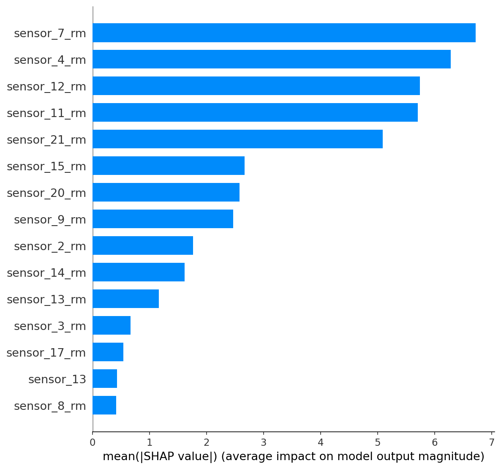

# Turbofan RUL Prediction — MLOps Pipeline

[](https://python.org)
[](https://spark.apache.org)
[](https://mlflow.org)
[](https://fastapi.tiangolo.com)
[](https://docker.com)
[](https://azure.microsoft.com)
[](https://github.com/lightonly1/turbofan-predictive-maintenance-mlops/actions)

---

Predicts the Remaining Useful Life (RUL) of aircraft engines using the NASA CMAPSS dataset. The goal was to go beyond just building a model — the entire workflow is production-ready, from PySpark preprocessing to a Dockerized API running on Azure with automated CI/CD.

Live API: https://turbofan-rul-app.azurewebsites.net/docs

---

## What this does

Raw sensor data from 100 turbofan engines goes through a PySpark pipeline that engineers 30 features, trains an XGBoost model tracked via MLflow, and serves predictions through a FastAPI endpoint deployed on Azure App Service. Every push to main automatically tests, builds, and redeploys via GitHub Actions.

---

## Stack

| Layer | Technology |
|-------|-----------|
| Data Processing | PySpark 4.1 |
| Experiment Tracking | MLflow 3.10 |
| Model | XGBoost |
| API | FastAPI + Pydantic |
| Containerization | Docker |
| Cloud | Azure Container Registry + App Service |
| CI/CD | GitHub Actions |
| Monitoring | Evidently-based drift detection |

---

## Project Structure

```
turbofan-predictive-maintenance-mlops/
├── src/
│   ├── preprocessing/
│   │   ├── spark_pipeline.py      # PySpark feature engineering
│   │   └── feature_store.py       # Feature store
│   ├── training/
│   │   └── train.py               # MLflow-tracked XGBoost training
│   ├── serving/
│   │   ├── app.py                 # FastAPI application
│   │   ├── schemas.py             # Request/response models
│   │   └── predictor.py           # Model loading and inference
│   ├── monitoring/
│   │   └── drift_detector.py      # Sensor drift detection
│   └── utils/
│       ├── config.py
│       ├── logger.py
│       └── azure_storage.py
├── configs/
│   └── config.yaml
├── tests/
│   └── unit/
├── .github/workflows/
│   └── ci-cd.yml
├── Dockerfile
└── requirements.txt
```

---

## Getting Started

```bash
git clone https://github.com/lightonly1/turbofan-predictive-maintenance-mlops.git
cd turbofan-predictive-maintenance-mlops
pip install -r requirements.txt
```

Download the [NASA CMAPSS dataset](https://www.kaggle.com/datasets/behrad3d/nasa-cmaps) and place the files in `data/raw/`.

```bash
# Preprocess
python -m src.preprocessing.spark_pipeline

# Train
python -m src.training.train

# Serve locally
uvicorn src.serving.app:app --reload --port 8000

# Run in Docker
docker build -t turbofan-rul-api .
docker run -p 8000:8000 turbofan-rul-api
```

---

## Model Results

| Metric | Value |
|--------|-------|
| MAE | 8.56 cycles |
| RMSE | 12.71 cycles |
| R² | 0.906 |

Tracked across 6 MLflow experiments. Best configuration: `n_estimators=200, max_depth=5, learning_rate=0.05`. Features include 15 raw sensor readings and 15 rolling-mean engineered features. Low-variance sensors (1, 5, 10, 16, 18, 19) were dropped after analysis.

---

## API

The API is live at https://turbofan-rul-app.azurewebsites.net/docs

| Endpoint | Method | Description |
|----------|--------|-------------|
| /health | GET | Health check |
| /predict | POST | Single engine prediction |
| /predict/batch | POST | Batch predictions |

Predictions include a risk level: CRITICAL (RUL <= 10), HIGH (<= 30), MEDIUM (<= 60), LOW (> 60).

---

## CI/CD

Push to main triggers: test → Docker build → push to Azure Container Registry → deploy to App Service.

All three stages currently passing.

---

## Monitoring

Drift detection runs across 30 features. On the current dataset, 6 out of 30 sensors showed more than 5% mean shift between the reference and current data windows — sensor_6 and sensor_6_rm showed the highest drift at around 19%.

```bash
python src/monitoring/drift_detector.py
```

---

## Dataset

NASA CMAPSS — 100 training engines, 21 sensor measurements per cycle.
Source: [NASA Prognostics Data Repository](https://www.nasa.gov/content/prognostics-center-of-excellence-data-set-repository)

---

## Model Results

### Actual vs Predicted RUL


### Feature Importance


### SHAP Summary


## Author

Krit Prakash
- LinkedIn: https://www.linkedin.com/in/krit-prakash-9a32a1246/
- GitHub: https://github.com/lightonly1
